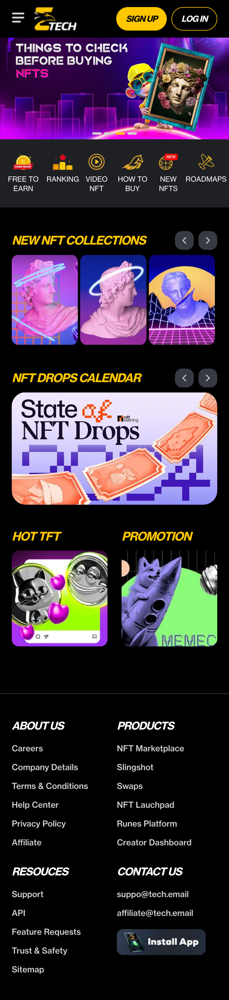
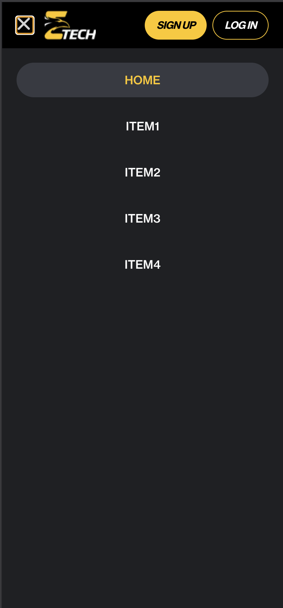

# Nevel NFT Marketplace

A modern NFT marketplace built with Next.js, featuring a sleek UI powered by TailwindCSS and Radix UI components.

> _Preview of Nevel NFT Marketplace homepage_




## 🔗 Live Demo

👉 [View Live Demo](https://nevel-tech-test-black.vercel.app/)

## 💻 Source Code

📦 [GitHub Repository](https://github.com/yaminthered/nevel-tech-test)

## Features

- ✨ Modern UI with responsive design
- 🖼️ NFT collections showcase
- 📅 Drop calendar for upcoming NFT releases
- 🏆 NFT rankings
- 📊 Free-to-earn opportunities
- 📹 Video NFT support
- 🛒 How-to-buy guides
- 🗺️ Project roadmaps

## Tech Stack

- [Next.js 15](https://nextjs.org/) - React framework
- [React 19](https://react.dev/) - UI library
- [TypeScript](https://www.typescriptlang.org/) - Type safety
- [TailwindCSS 4](https://tailwindcss.com/) - Utility-first CSS
- [Radix UI](https://www.radix-ui.com/) - Unstyled, accessible components
- [Embla Carousel](https://www.embla-carousel.com/) - Carousel component
- [Lucide React](https://lucide.dev/) - Icon library
- [PNPM](https://pnpm.io/) - Fast, disk space efficient package manager

## Getting Started

### Prerequisites

- [Node.js](https://nodejs.org/) (v18 or later)
- [PNPM](https://pnpm.io/) (v7 or later)

### Installation

1. Clone the repository:

```bash
https://github.com/yaminthered/nevel-tech-test.git
cd nevel-tech-test
```

2. Install dependencies:

```bash
pnpm install
```

3. Start the development server:

```bash
pnpm dev
```
4. Open your browser and navigate to [http://localhost:3000](http://localhost:3000) to see the result.

### Project Structure

```
nevel-test/
├── public/             # Static assets
├── src/
│   ├── app/            # App router pages
│   ├── assets/         # Images and other assets
│   ├── components/     # Reusable components
│   │   ├── home/       # Home page components
│   │   └── ui/         # UI components
│   └── styles/         # Global styles
├── .gitignore
├── .prettierrc         # Prettier configuration
├── eslint.config.mjs   # ESLint configuration
├── next.config.ts      # Next.js configuration
├── package.json
├── pnpm-lock.yaml
├── postcss.config.mjs  # PostCSS configuration
├── README.md
└── tsconfig.json       # TypeScript configuration
```

### Available Scripts
- `pnpm dev` - Run development server with Turbopack
- `pnpm build` - Build for production
- `pnpm start` - Start production server
- `pnpm lint` - Run ESLint

## Customization
## Styling
The project uses TailwindCSS for styling. Customize the theme in the TailwindCSS configuration file.

## Components
UI components are built using Radix UI primitives combined with TailwindCSS for styling. Check out the `src/components/ui` directory for reusable components.

## Deployment

The easiest way to deploy your Next.js app is to use the [Vercel Platform](https://vercel.com/new?utm_medium=default-template&filter=next.js&utm_source=create-next-app&utm_campaign=create-next-app-readme) from the creators of Next.js.

Check out the [Next.js deployment documentation](https://nextjs.org/docs/app/building-your-application/deploying) for more details.
